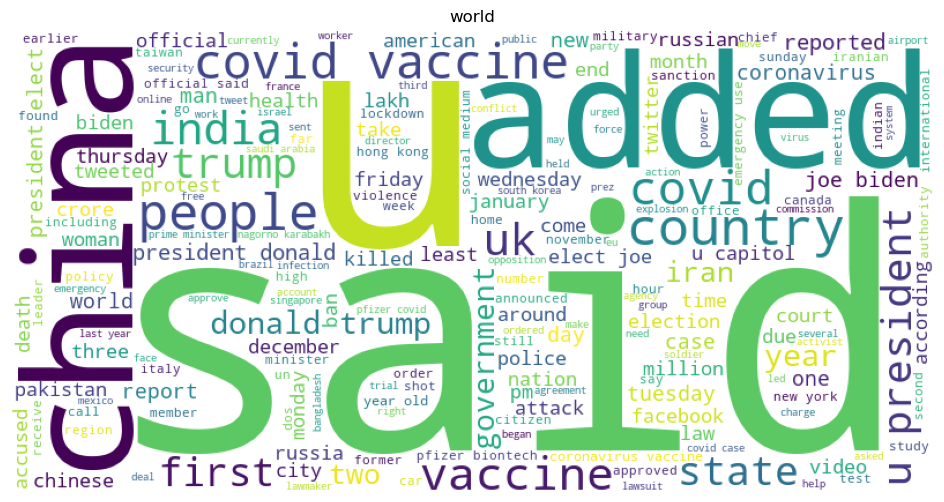

# Detecting PIK3CA mutation in breast cancer

Implementing CHOWDER method

[Challenge by Owkin](https://challengedata.ens.fr/challenges/98)

## Introduction

Histopathological image analysis (HIA) is critical for disease diagnosis, especially in oncology where it defines the gold standard. Machine learning (ML) has been used to assist pathologists in detecting diseases, but most of the methods require localized annotation masks that are expensive and limited. Deep convolutional neural networks (DCNNs) have shown promise for HIA. The Owkin Breast Cancer Histology Challenge aims to detect PIK3CA mutations in breast cancer patients using multiple-instance learning (MIL).

## Description

The main objective of this project is to implement the CHOWDER method[1] for whole slide image (WSI) classification. Specifically, the CHOWDER method aims to adapt and improve the WELDON method[2], which was designed for histopathology image analysis, to handle bags of WSI. This method uses a multiple instance learning (MIL) approach that uses top instances and negative evidence to classify WSI. The task involves implementing the CHOWDER method on a given dataset originally coming from the TCGA-BRCA dataset, which contains 344 training samples from 305 unique patients each including 1000 tiles and 76 testing slides with a binary classification task of distinguishing between normal and PIK3CA mutated tissues. 

## CHOWDER Model

In order to improve the performance of the baseline approach on datasets such as Camelyon-16 which the diseased regions of most of the slides are highly localized, and restricted to a very small area within the WSI, an adaptation and improvement of the WELDON method designed for histopathology image analysis. The approach utilizes a MIL method that uses both top instances and negative evidence to create a more effective global slide descriptor. 


## Improvements

The CHOWDER method shows promising results for WSI classification, but there is still room for improvement.

### Quantile Method: 

One possible area for enhancement is to replace the existing MinMax layer. The purpose of this new method is to select features based on the given quantiles, rather than just the numbers of minimum and maximum features. This method has the advantage of allowing the model to use broader features than just the minimum and maximum ones which are not robust to outliers. Additionally, the new quantile method was designed in PyTorch and implemented into the existing chowder model and can be easily used by setting the related parameters in the configuration file.


# Installation

## Mambaforge
Download the `mamba` installation file corresponding to your system from here:
https://github.com/conda-forge/miniforge#mambaforge

run the file using:

```bash
bash <FILE_NAME>
```
For example:
```bash
bash Mambaforge-MacOSX-x86_64.sh
```

## Environment installation
After the mamba installation, open a new terminal. Go to this package folder and run:
```bash
make install
```

After the installation, activate the environment:

```bash
mamba activate chowder
```

## Environment update
If you change any of the environment files, you can update your environment by running:
```bash
make update
```

## Test
To run tests and test coverage, simply run:
```
make test_and_coverage
```

## Train
To train the model or predict the test data, simply run:
```
make train
```
```
make predict
```


## Reference

1. 	Courtiol P, Tramel EW, Sanselme M, Wainrib G. Classification and Disease Localization in Histopathology Using Only Global Labels: A Weakly-Supervised Approach. 2018 
2. 	Durand T, Thome N, Cord M. WELDON: Weakly Supervised Learning of Deep Convolutional Neural Networks. 